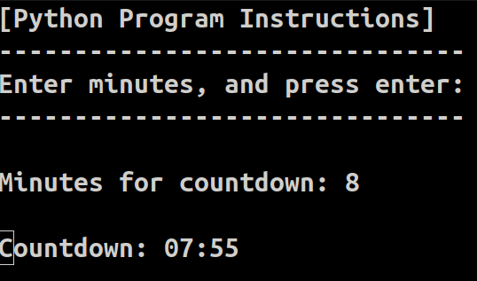

# Python Countdown Timer

**python_countdown_timer** is a simple yet effective countdown timer program written in Python. This tool allows end-users to set a countdown timer for a specified number of minutes and displays the remaining time clearly and concisely. Once the countdown reaches zero, a "Timer Complete" message is displayed.

## Functionalities

- **Easy to Use:** Enter the countdown time, and the timer does the rest.
- **Cross-Platform Compatibility:** Works on Windows and Linux-based systems with automatic screen clearing.
- **Real-Time Display:** The countdown is in MM:SS format.
- **Minimal Dependencies:** Only requires the built-in `os` and `time` modules.

## Installation

### Redhat-based Distros
To install Python 3 on Redhat-based distributions, use the following command:

```sh
sudo dnf install python3
```

### OpenSUSE-based Distros
To install Python 3 on OpenSUSE-based distributions, use the following command:

```sh
sudo zypper install python3
```

### Debian-based Distros
To install Python 3 on Debian-based distributions, use the following command:

```sh
sudo apt update && sudo apt install python3 -y
```

## Usage
To use this countdown timer, clone the repository and run the script using Python 3:

clone the GitHub repository

```sh
git clone https://github.com/LinuxSystemsEngineer/python_countdown_timer.git
```

change directories to your newly cloned GitHub repository
```sh
cd python_countdown_timer
```

run the python program
```sh
python3 countdown_timer.py
```

Follow the on-screen instructions to enter the desired number of minutes for the countdown.

## Contributions
Contributions are welcome! Feel free to fork this repository, make improvements, and submit a pull request.

## Screenshot
Here is a screenshot of the Python countdown timer running:


